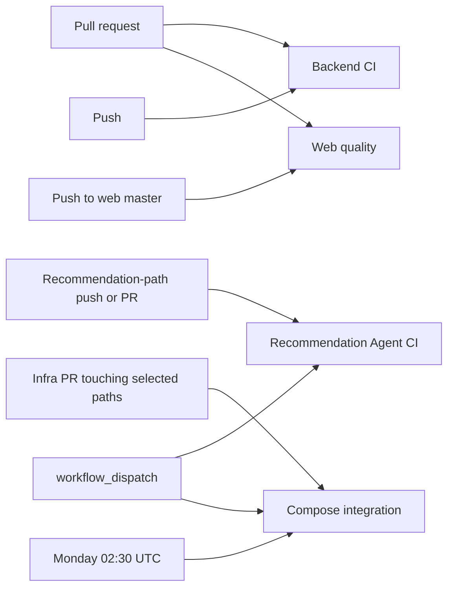

# FoodMind CI flow audit — 2026-08-13

## Scope and snapshot

This is the baseline for subsequent CI work. Per the requester’s direction, it covers only repositories that are currently in scope for CI maintenance:

| Repository | Default branch at inspection | Workflow(s) in scope | Latest relevant GitHub Actions observation (UTC) |
| --- | --- | --- | --- |
| `foodmind-backend` | `master` at `85ad30c` | `Backend CI` | Success for `85ad30c`, run [31622356733](https://github.com/foodmind-team/foodmind-backend/actions/runs/31622356733), 2026-08-12 17:23–17:26. A later feature-branch run, [31695509736](https://github.com/foodmind-team/foodmind-backend/actions/runs/31695509736), also completed successfully on 2026-08-13. |
| `foodmind-infra` | `master` at `0f5840d` | `Compose integration` | Latest observed PR run succeeded: [31688289329](https://github.com/foodmind-team/foodmind-infra/actions/runs/31688289329), 2026-08-13 09:48–09:51. The workflow does not run on pushes to `master`. |
| `foodmind-intelligence` | `main` at `b27d585` | `Recommendation Agent CI` | The most recent Recommendation-path run succeeded at `5c46a2e`: [31581506013](https://github.com/foodmind-team/foodmind-intelligence/actions/runs/31581506013), 2026-08-12 09:07–09:08. The checked-out `main` head has later Chat/Cooking-only changes and did not trigger this workflow. |
| `foodmind-web` | `master` at `29f1d37` | `Web quality` | Success for `29f1d37`, run [31607391635](https://github.com/foodmind-team/foodmind-web/actions/runs/31607391635), 2026-08-12 14:33–14:34. |

Excluded by explicit direction: `foodmind-docs`, `foodmind-ml`, and `foodmind-android`. They are not assessed or used to support the findings below.

Evidence was collected from the checked-out workflow/source files and GitHub Actions history at 2026-08-13T19:31+08:00. No workflow was manually dispatched, and no existing application source or CI configuration was changed for this audit.

## Current flow map

There is no deployment, package publication, release promotion, or environment-approval workflow in the four repositories in scope.

## Repository detail

### Backend — `Backend CI`

**Trigger and execution.** Pull requests and pushes to every branch run a single 30-minute Ubuntu job. It checks out the code, installs Temurin 17, makes `mvnw` executable, validates the committed OpenAPI file with `scripts/validate-openapi.py`, then executes `./mvnw clean test` under `SPRING_PROFILES_ACTIVE=test`.

**What it proves.** The default-branch run above proves the committed OpenAPI validator and the standard Maven test phase passed. The test suite includes Spring Boot / PostgreSQL Testcontainers-based tests, so this is more than a pure compilation gate.

**What it does not prove.** The workflow neither builds a distributable artifact nor executes Maven `verify`. The `live-agent` Maven profile owns Failsafe `*LiveIT` execution and is not invoked by CI. There is no Maven dependency cache, test-report artifact, coverage threshold, dependency/secret/container scan, action-SHA pinning, or concurrency cancellation.

### Infrastructure — `Compose integration`

**Trigger and execution.** This workflow is intentionally selective: it runs for non-draft PRs only when Compose, environment, submodule, script, service, or workflow paths change; it also supports manual dispatch and a Monday 02:30 UTC schedule. `validate` checks `docker compose --env-file .env.example config --quiet`. `stack-smoke` recursively checks out submodules, builds and starts the offline stack, waits up to 240 seconds, calls Backend readiness at `/actuator/health/readiness`, prints Compose state/logs, then destroys volumes and containers.

**What it proves.** The latest PR execution proves the committed PR stack could render, build, start, and expose Backend readiness on the GitHub-hosted runner.

**What it does not prove.** There is no `push` trigger, so a direct `master` update has no immediate Compose verification; its next automatic check is the weekly schedule. Logs are printed but not uploaded as artifacts. The workflow has no image provenance/SBOM/vulnerability gate and uses action tags rather than immutable action SHAs.

### Intelligence — `Recommendation Agent CI`

**Trigger and execution.** Only explicit Recommendation-Agent, recommendation-contract, fixture, selected deployment/documentation, and workflow paths trigger it. It uses Python 3.13 and `uv --frozen` and has five parallel gates: formatting/lint/type checking; pytest with warnings-as-errors, fixture smoke, and release-evidence validation; contract/security tests plus exact three-route OpenAPI assertion; dependency audit, license inventory, scoped Gitleaks scan; and an image build with non-root/read-only inspection, SBOM, and CRITICAL/HIGH Trivy scan. `merge-gate` requires all five gates to succeed.

**Strengths.** It is the most complete CI flow in scope. Its third-party Actions and scanned container images are pinned by immutable SHA/digest; its own supply-chain test verifies those constraints. Dependency, secret, license, image, type, contract, and runtime-container controls are all explicit.

**Current coverage gap.** The current `main` head contains later changes under `agent-service/app/agents/chatbot/**` and `agent-service/app/agents/cooking/**`; neither path is included in the trigger filter, so `b27d585` has no corresponding CI run. The only other workflow-shaped file, `agent-service/app/agents/cooking/.github/workflows/ci.yml`, is nested below the repository root; GitHub Actions recognizes workflows only in root `.github/workflows`, so it is not executable by GitHub Actions. The inference service, Chat Agent, and Cooking Agent therefore have no recognized CI gate in this repository.

**Historical failure.** Runs [31573944888](https://github.com/foodmind-team/foodmind-intelligence/actions/runs/31573944888) and its matching push run failed on 2026-08-12 because `verify_release_evidence.py` detected an image-source-tree checksum mismatch. The next runs at the corrected revision succeeded. This is resolved evidence, not a current failure.

**Remaining limitations.** Test coverage is reported with missing lines but has no configured minimum. The workflow has no explicit report/SBOM artifact-retention step, no concurrency control, and no CI coverage for the non-Recommendation components.

### Web — `Web quality`

**Trigger and execution.** Every PR and pushes to `master` run a 20-minute Ubuntu job. Per-ref concurrency cancels superseded work. Node 24.16.0 runs `npm ci`, then `npm run validate` (OpenAPI lock/schema/usage checks, Oxlint, TypeScript, Vitest coverage, production build and bundle check), `npm run security:check`, a tracked-file credential pattern scan, Chromium installation, and Playwright E2E. Coverage and Playwright evidence are retained for 14 days.

**What it proves.** The default-branch run above passed deterministic API-usage checks for the checked-in contract, linting, type checking, unit/coverage execution, production build/bundle checks, allowed dependency-vulnerability policy, credential pattern scan, and browser E2E.

**Boundary of the API check.** In a GitHub checkout the sibling Backend repository is absent, so `api:check` validates the committed OpenAPI snapshot, lock metadata, generated schema, and API coverage—not the live/current Backend branch. Locally, when the sibling Backend source is available, the same script additionally compares it with the snapshot. The checked-in snapshot and Backend source were identical at the audit snapshot, but CI itself does not continuously make that cross-repository comparison.

**Boundary of E2E.** Playwright starts the Vite application at `127.0.0.1:4173`; the workflow does not start Backend or other services. Thus it is browser E2E for the Web application, not a real service-integration gate.

**Security policy.** `security:check` calls `npm audit --json` and fails unreviewed high/critical findings, but permanently permits advisory `GHSA-qwww-vcr4-c8h2` based on its documented Vite SPA non-reachability assessment. Low/moderate findings are not blocking. Actions are tag-pinned, rather than immutable-SHA pinned.

## Cross-repository control findings

| Priority | Finding | Affected flow(s) | Why it matters |
| --- | --- | --- | --- |
| P1 | No repository-level default-branch protection or repository ruleset was returned for any in-scope repository. | Backend, Infra, Intelligence, Web | A passing CI run is not an enforced merge condition. Direct updates can bypass the intended gate; this compounds Infra’s lack of a push trigger and Intelligence’s selective triggering. Organization-wide policies were not inspected. |
| P1 | Intelligence CI is limited to Recommendation paths while current `main` has later Chat/Cooking changes. | Intelligence | Those changes have no recognized GitHub Actions validation at the current head. The nested Cooking workflow cannot compensate. |
| P1 | Infra validates a change in PR but not the resulting `master` push. | Infra | A direct update or merge-time divergence is not immediately smoke-tested; only a manual run or the weekly schedule follows. |
| P2 | Backend omits packaging/`verify` and the `live-agent` integration profile. | Backend | Standard tests are strong, but release readiness and live-agent integration are outside the routine gate. |
| P2 | Web’s CI contract and E2E checks are repository-local. | Web | They cannot prove compatibility with the current Backend or a live multi-service stack from the Web workflow alone. |
| P2 | Supply-chain/security rigor is inconsistent. | Backend, Infra, Web | Intelligence has pinned actions, dependency/license/secret/image scans and SBOM; the other flows do not match that assurance level. |
| P3 | Failure evidence retention and quality thresholds are uneven. | Backend, Infra, Intelligence, Web | Backend exposes no reports; Infra prints logs only; Intelligence has no explicit retained reports; Web/Intelligence report coverage but configure no minimum threshold. |

## Recommended work order for the next phase

1. Make CI enforceable first: establish default-branch required checks/rulesets, choosing check names only after the desired trigger coverage is agreed.
2. Restore complete Intelligence component coverage by moving/adding root-level workflows for Chat, Cooking, and inference, or by deliberately broadening a single workflow without weakening Recommendation gates.
3. Make Infra verify the post-merge/default-branch stack, retain diagnostics, and decide whether the weekly smoke remains a supplement or becomes a separate reliability check.
4. Decide which release/integration assurance belongs in routine Backend/Web CI versus a separately scheduled or manually approved environment gate; then add artifacts, immutable action references, and security controls consistently.

## Audit limits

- This is an investigation, not a remediation or a fresh end-to-end execution.
- The run conclusions are GitHub Actions results observed at the timestamp above; they do not prove the current state of external services or deployments.
- Local worktree changes outside this new audit file were preserved. In particular, existing Infra submodule-pointer changes were not inspected or modified.
