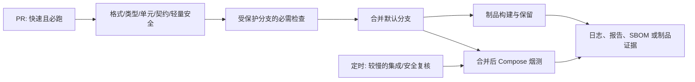

# CI 优化待办（待审核）

> 状态：**待审核，尚未实施**。目标是让 FoodMind 的 CI 在不扩大无效执行和不引入高噪声门禁的前提下，更轻量、更稳定、更难被绕过。
>
> 范围仅限 `foodmind-backend`、`foodmind-infra`、`foodmind-intelligence`、`foodmind-web`。`foodmind-docs`、`foodmind-ml`、`foodmind-android` 按当前决定不在本轮范围内。`foodmind-infra` 的 AWS 部署（`compose.aws-demo.yaml`、`.env.aws.example`、远端环境、部署凭据与部署规则）也明确不在本轮范围内。

本待办以 [CI 现状调查](ci-flow-audit-2026-08-13.md) 为事实基线。它不是“一次把所有 DevSecOps 工具都加上”的计划：优先保留已经快速、稳定且有价值的检查；昂贵、依赖真实环境或容易产生误报的检查后置到合并后、定时或手动阶段。

## 本轮实施状态（尚未推送）

- 已在本地完成并验证：CI-02、CI-03、CI-04、CI-05、CI-06、CI-07、CI-09；CI-08 的高置信度凭据扫描已落地，依赖/静态安全基线仍按分阶段策略推进。
- 暂缓：CI-01 的 GitHub ruleset/required-check 外部配置、CI-10 指标存储、CI-11 真实环境入口。它们需要已推送且成功的工作流作为依据；本轮也不得影响既有 AWS 部署。
- 已知稳定性项：Cooking 精简套件在本地 1152 项通过，但会产生 6 条未关闭 SQLite 连接的资源警告。该警告保持可见，未被静默忽略；在修复资源生命周期前，不将它升级为 `-W error` 硬门。

## 课程依据与设计原则

| 课程材料 | 可采纳原则 | 对本轮的具体约束 |
| --- | --- | --- |
| `05 - Continuous Integration v1.0.pdf`，第 7 / 19 页；`lesson-key-takeaways/05-continuous-integration.md` | CI 依赖版本控制、自动化构建和团队承诺；快速反馈优先，失败须及时修复或回退。 | PR 门禁应短、确定、每次变更均可运行；不要用“允许失败”或静默重试掩盖红灯。 |
| `04 - Software Build Management v1.0.pdf`，第 7 / 15 页；`lesson-key-takeaways/04-software-build-management.md` | 可复现构建应产生制品，并保留日志/证据；全量构建可放在适当的较慢层。 | 日常 PR 不重复做昂贵工作；合并后构建需要可追溯的制品和失败证据。 |
| `09 - Test Automation v1.0.pdf`，第 27 页；`lesson-key-takeaways/09-test-automation.md` | 优先自动化高风险、重复、耗时且可客观判定的测试；GUI 和探索性检查不应吞没反馈速度。 | 单元、静态、契约检查留在 PR；真实多服务/浏览器路径留在合并后或定时层。 |
| `07 - Secure CI-CD Pipeline v1.0.pdf`，第 7–8 页；`lesson-key-takeaways/07-secure-ci-cd-pipeline.md` | 保护仓库、权限、密钥和临时资源；门禁必须可执行。 | 先修复“CI 可绕过”，采用最小权限和固定 Action 引用；结束时清理测试资源并留取诊断。 |
| `08 - Software Composition Analysis (SCA) v1.0.pdf`，第 3 页；`10 - Static application security testing (SAST) v1.0.pdf`；`lesson-key-takeaways/08-software-composition-analysis-sca.md` | SCA/SAST 要左移，但误报会损害团队对门禁的信任。 | 先只阻塞密钥和新出现的高/严重依赖风险；SAST 先基线和调优，不在没有信号质量前全面阻塞。 |
| `12 - Infrastructure as Code and Compliance as Code v1.2.pdf`，第 16 / 23–25 页；`lesson-key-takeaways/12-infrastructure-as-code-and-compliance-as-code.md` | 基础设施应作为可审查、可测试、可复现的单一事实来源；政策可表达为测试。 | Compose 渲染、健康检查、最小安全策略和失败日志应自动化；避免把手工环境状态作为门禁依据。 |

### 非谈判性准则

1. **先强制，后扩容。** 没有默认分支规则/必需检查的“绿灯”不是可靠门禁。
2. **每个检查都有层级。** PR 快速门、合并后验证、定时深度检查三层职责不同，禁止同一昂贵任务无差别重复运行。
3. **失败必须可诊断且不能被隐藏。** 允许收集额外诊断，但不以自动忽略、无说明重试或降低断言来换取绿灯。
4. **安全例外必须显式、窄化、有负责人和到期日。** 不能把当前 Web 的单个审查例外扩大为通用豁免。
5. **先测量再设阈值。** 首轮收集耗时、失败类别和覆盖率基线；没有基线前，不设置会制造随机红灯的覆盖率目标。

## 目标流水线

建议的初始服务目标是：在 20 次成功样本后，PR 快速门的 P95 不超过 10 分钟；低于该目标的现有流程不应因本轮优化变慢。当前单次成功样本约为 Backend 3 分 20 秒、Infra 2 分 18 秒、Intelligence 43 秒、Web 1 分 44 秒，**不能**视为稳定性或 P95 指标。

## 待办清单

### 第一批：先消除绕过与遗漏（P1）

- [ ] **CI-01：建立四个仓库的默认分支规则与必需检查。**
  - 范围：Backend、Infra、Intelligence、Web。
  - 做法：在 GitHub ruleset/branch protection 中只要求每个仓库稳定、始终产生的 PR 检查；禁止直接绕过，限制谁可修改规则。
  - 注意：Infra 现有工作流带 `paths` 条件，不能直接把一个可能“不产生”的检查设为全局必需检查；需新增始终返回的轻量门，或采用支持条件化要求的规则设计。
  - 验收：同一仓库中，未通过对应必需检查的 PR 不能合并；不触发 Compose 烟测的无关 PR 不会因“缺失检查”被卡死。

- [ ] **CI-02：修正触发覆盖，同时消除重复执行。**
  - Backend：PR 保持全分支；把 `push` 限制为 `master`，避免同一功能分支同时跑 PR 和 push 的重复 Maven 全量测试。
  - Intelligence：将 Chat、Cooking、inference 的实际 CI 工作流放在仓库根 `.github/workflows/`，或建立经过验证的统一组件矩阵；删除或迁移当前不会被 GitHub 识别的嵌套 Cooking workflow。
  - Infra：保留路径过滤的 PR 烟测，并补充默认分支的路径过滤 `push` 验证；确保默认分支的最终 Compose 文件一定会被检查。
  - 验收：修改 Chat、Cooking、inference、Backend、Web、Compose 各一处时，预期检查都能在 Actions 页面出现；一个功能分支 PR 不会因双触发而执行两次等价的重门。

- [ ] **CI-03：为可取消的流水线统一添加并验证并发控制。**
  - 范围：Backend、Infra、Intelligence；Web 已有 per-ref 并发控制，保留。
  - 做法：按工作流和 PR/分支分组，取消过期运行；合并后默认分支运行不可被较旧运行覆盖。
  - 验收：连续推送同一 PR 时，仅最新运行继续消耗 runner；最终状态对应最新 SHA。

### 第二批：强化快速反馈与可诊断性（P1/P2）

- [ ] **CI-04：为 Backend 加入可靠且不会重复测试的可发布构建。**
  - 做法：先在单独分支验证以 `./mvnw -B clean verify` 取代仅 `clean test` 的耗时、测试集合与产物；确认不会意外启用需要真实外部凭据的 `live-agent` profile。仅在验证通过后切换。
  - 制品：默认分支上传 JAR、Surefire/Failsafe 报告和 OpenAPI 验证证据；PR 失败时上传足以定位问题的测试报告，不发布可消费制品。
  - 验收：成功默认分支运行能下载并追溯到 SHA 的 JAR 和测试报告；失败可在不重跑的情况下定位首个失败测试。

- [ ] **CI-05：补齐最小失败证据与缓存，不缓存易失真的状态。**
  - Backend：使用 `setup-java` 的 Maven 依赖缓存；失败时上传 Surefire 报告。
  - Infra：保留 `docker compose down --volumes`，并在失败时将 `compose ps` 与完整受限日志上传为短期 artifact；不复用运行中容器或卷。
  - Intelligence：显式保留 pytest 覆盖率、许可证清单、SBOM 与扫描摘要；不把扫描失败吞掉。
  - Web：保留现有 14 天浏览器/覆盖率证据，检查其大小和失败定位价值后再决定是否缩短保留期。
  - 验收：缓存仅覆盖依赖下载；清理后的下次运行不依赖上一轮容器、数据库或工作目录；任一失败都有可下载诊断。

- [ ] **CI-06：定义测试分层和时间预算，不以“更多 E2E”替代稳定性。**
  - PR 快速门：格式、lint、类型、单元测试、契约/生成物一致性、可离线的高价值安全检查。
  - 合并后：Backend 可发布构建、Compose 烟测和最小健康/关键路径验证。
  - 定时/手动：真实多服务回归、DAST、较慢容器或依赖复核。先提供可重复的环境、认证和失败证据，再讨论是否阻塞发布。
  - 验收：每个检查在文档中有明确层级、最长预算、输入、输出和失败负责人；不存在每个 PR 都启动全量真实栈的设计。

### 第三批：一致的安全基线（P2）

- [ ] **CI-07：最小权限与 Action 供应链对齐。**
  - 做法：所有 workflow 显式声明最小 `permissions`；将 Backend、Infra、Web 所用第三方 Action 固定到 commit SHA，并保留可读版本注释。为固定版本建立受控更新机制。
  - 验收：workflow 不依赖组织默认写权限；所有第三方 `uses:` 都是可审计的不可变引用；更新可在独立 PR 中复核。

- [ ] **CI-08：实施分阶段的密钥和依赖风险策略。**
  - 第一阶段：每个仓库建立密钥扫描与依赖审计基线；只阻塞新出现的密钥，以及未获审查的高/严重依赖风险。将例外记录为仓库内条目，包含影响、缓解、负责人、复审/到期日期。
  - 第二阶段：在基线和误报处理完成后，评估轻量 SAST；先报告、调优规则，再决定关键规则是否阻塞。
  - 不做：不在首轮将 DAST 或全量 SAST 设为每个 PR 的硬门；不把中低风险告警一律升级为红灯。
  - 验收：新增高风险问题不能无记录合并；已知例外可被精确追溯且会到期复审；日常 PR 运行时间仍满足快速门目标。

- [ ] **CI-09：把基础设施的最小安全/合规规则编码化。**
  - 起点：Compose 配置必须可渲染；服务不能使用未声明的敏感环境变量；健康检查和资源清理必须存在；发布端口、特权模式、明文密钥等规则需显式检查。
  - 做法：先从小型、确定性的脚本或 Compose policy test 开始；不引入需要远端云账户的策略引擎作为 PR 前置条件。
  - 验收：违反一条已编码规则的 Compose 变更会在本地和 CI 中稳定失败，并给出可操作的原因。

### 第四批：稳定性度量与持续改进（P2）

- [ ] **CI-10：建立可审计的流水线健康指标。**
  - 记录：每个工作流的排队时间、执行时间、成功率、取消率、失败类别、重跑率和 artifact 大小；覆盖率先记录趋势，不强制总百分比。
  - 复盘节奏：每两周审查一次慢步骤和重复失败；优先修复确定性故障，再优化耗时。
  - 验收：可以回答“哪个步骤慢、哪类失败最多、修复后是否改善”，并据此调整预算或门禁。

- [ ] **CI-11：为真实环境检查准备受控的后置入口。**
  - 前提：专用非生产凭据、明确的清理策略、测试数据隔离、稳定健康探针和失败日志。
  - 候选：Infra 的定时 Compose 烟测从每周评估为每日；Web/Backend 的真实关键路径和 DAST 仅在受控环境中定时或手动运行。
  - 验收：任何真实环境检查不会触碰生产数据或持久凭据；失败不会阻塞无关 PR，但会生成可追踪的问题和证据。

## 建议实施顺序与审批点

| 顺序 | 工作项 | 需要的审批/决定 | 完成定义 |
| --- | --- | --- | --- |
| 1 | CI-01 | 允许配置 GitHub ruleset/branch protection，以及各仓库的必需检查名称。 | 四仓库不能绕过核心 PR 门。 |
| 2 | CI-02、CI-03 | 接受触发策略调整与旧嵌套 Cooking workflow 的迁移。 | 没有当前未覆盖组件，也没有等价重复重跑。 |
| 3 | CI-04、CI-05、CI-06 | 认可 Backend `verify` 验证分支和 artifact 保留策略。 | 快速门与合并后门各自稳定、可诊断。 |
| 4 | CI-07、CI-08、CI-09 | 确认安全例外治理方式，以及首次阻塞的风险级别。 | 最小权限、可审计供应链、低噪声安全基线落地。 |
| 5 | CI-10、CI-11 | 认可指标存放位置与真实环境资源预算。 | 优化可量化，慢检查不挤占 PR 反馈。 |

## 明确暂缓的事项

- 不把完整真实多服务 E2E、DAST、性能测试或全量镜像扫描塞进每个 PR。
- 不在没有历史基线的情况下设置全仓覆盖率硬阈值。
- 不用忽略失败、无限重试、禁用测试或宽泛安全豁免来制造绿灯。
- 不在本待办获批前修改 workflow、GitHub 规则、秘密、部署或外部环境。
