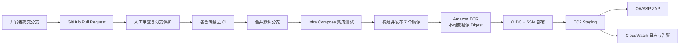

# FoodMind CI/CD 架构与技术选型说明

**项目：** FoodMind
**用途：** SA4106 AD Project DevSecOps 演示与答辩
**环境：** GitHub repositories + AWS staging (`ap-southeast-1`)
**最后更新：** 2026-08-15

## 1. 文档目的

本文说明 FoodMind 为什么采用当前 CI/CD 架构、一次代码变更如何通过流水线，以及每项技术分别解决什么工程或安全问题。

FoodMind 不是单一应用，而是一个多仓库、多语言、多服务系统：

| 仓库/组件 | 主要技术 |
| --- | --- |
| Backend | Java 17、Spring Boot、Maven、PostgreSQL、OpenAPI |
| Web | React、TypeScript、Node.js、npm、Vitest、Playwright |
| Android | Kotlin、Gradle、Android Lint |
| Intelligence | Python 3.13、`uv`、Recommendation/Cooking/Chatbot/Inference |
| ML | Python、模型与 runtime package |
| Infra | GitHub Actions、Docker Compose、CloudFormation、Shell |
| Docs | 版本化项目文档和安全证据 |

因此，本项目没有采用单一的“编译后直接部署”脚本，而是采用：

> 各仓库独立 CI + Infra 仓库统一集成和发布 + AWS staging 自动 CD + 部署后 DAST 与运行监控。



## 2. 为什么选择这套 CI/CD 架构

### 2.1 各仓库独立 CI，缩短反馈时间

Backend、Web、Android、ML 使用不同语言和构建工具。如果所有检查都集中到一个大型流水线，任何小改动都需要重建整个系统，不仅耗时，也难以定位问题。

因此，每个仓库运行与其技术栈匹配的 CI：

- Backend 改动运行 Java、Maven、OpenAPI 和依赖检查。
- Web 改动运行 Node、lint、类型检查、单元测试和构建检查。
- Android 改动运行 Gradle、单元测试、Android Lint 和 APK 构建。
- Intelligence 根据修改路径选择 Recommendation、Cooking、Chatbot 或 Inference 检查。
- ML 独立验证代码、模型打包、依赖与许可证。
- Infra 负责完整 Compose 集成测试和发布契约检查。

这种设计减少了无关构建，也能让失败信息更接近发生问题的组件。

### 2.2 Infra 仓库作为统一发布控制点

CI 可以分散，但发布不能由各仓库随意进行，否则容易出现：

- Backend 已升级，而 Web 或 Android 仍使用旧 API。
- Intelligence 与 ML 模型版本不匹配。
- 无法确定 staging 实际部署了哪些 commit。
- 使用 `latest` 等可变 tag，导致同一发布名称对应不同内容。

因此，Infra 仓库负责定义一个完整 release：

- Backend、Intelligence 和 ML 由 Git submodule commit 固定。
- Web revision 由 `releases/staging-source.json` 固定。
- 发布后生成包含七个 ECR image digest 的 release manifest。
- 部署只接受经过 schema、账号、Region、source SHA 和 digest 验证的 manifest。

这相当于：

> 各组件 CI 证明组件可用，Infra 定义哪些经过验证的组件共同组成一个可部署 release。

### 2.3 安全检查覆盖整个软件生命周期

安全检查被放置在不同阶段，而不是只在部署前执行一次：

| 阶段 | 主要控制 |
| --- | --- |
| 编码和 PR | 格式、lint、类型检查、安全测试、人工审查 |
| 依赖 | Dependency Review、`pip-audit`、`npm audit`、许可证策略 |
| 源码与配置 | Gitleaks、自定义 secret checker、OpenAPI/配置合同检查 |
| 镜像 | 非 root/只读检查、SBOM、Trivy |
| 集成 | Compose policy、CloudFormation lint、完整 stack smoke test |
| 发布 | ECR immutable tag、scan-on-push、SHA-256 digest manifest |
| 部署 | OIDC、最小权限 IAM、SSM、迁移前 RDS snapshot、自动镜像回滚 |
| 部署后 | 安全响应头 gate、OWASP ZAP DAST |
| 运行时 | CloudWatch Logs、CloudWatch Alarms、SNS |

不同工具检测不同类型的风险，不能相互替代。例如：

- SCA 发现已知第三方依赖漏洞。
- Gitleaks 发现误提交的凭证。
- Trivy 检查镜像操作系统和软件包。
- ZAP 检查真实运行中的 HTTP 行为。
- CloudWatch 负责部署后的运行状态。

### 2.4 构建和部署分离

Publish 阶段负责：

1. 检查准确的 source revision。
2. 构建七个镜像。
3. 推送 Amazon ECR。
4. 从 ECR 查询真实 digest。
5. 生成并上传 release manifest。

Deploy 阶段负责：

1. 下载 Publish 产生的 manifest。
2. 验证账号、Region、source SHA 和 image digest。
3. 拉取已经构建好的镜像。
4. 启动服务并执行健康检查。
5. 失败时恢复上一次成功的镜像集合。

EC2 不从源代码重新构建应用，部署引用使用：

```text
repository@sha256:<64-character-digest>
```

而不是：

```text
repository:latest
```

因此，在 Publish 和 Deploy 之间，镜像内容不能被同名 tag 静默替换。

### 2.5 最小权限和短期 AWS 凭证

GitHub Actions 不保存长期 AWS Access Key，而是通过 GitHub OIDC 向 AWS STS 申请短期凭证。

权限按职责拆分：

- Publisher role 只能向指定的七个 ECR repository 推送和查询镜像。
- Deploy role 只能向指定 EC2 发送 SSM 命令，并在需要时操作指定 RDS snapshot。
- EC2 role 只能拉取指定镜像、读取指定数据库 secret、访问指定 S3 prefix，并写入指定日志组。

这样即使某个流水线步骤被滥用，其可访问范围仍受到 IAM policy 限制。

### 2.6 可审计、可复现和证据留存

流水线保留以下证据：

- Git commit SHA 和 PR 审查记录。
- 必需 CI gate 结果。
- Maven、Gradle、pytest、coverage 和 Playwright 报告。
- 依赖、许可证和 SBOM 文件。
- Compose 状态和诊断日志。
- 七个 ECR image digest。
- Release manifest。
- SSM deployment 状态。
- ZAP artifact。
- CloudWatch logs 和 alarms。

因此可以回答：谁在什么时候批准了什么代码、运行了哪些检查、产生了什么镜像、部署了哪个版本，以及部署后的安全测试结果是什么。

### 2.7 与项目成本和规模相匹配

当前 staging 使用单 EC2、Docker Compose、RDS PostgreSQL、Caddy 和 CloudWatch，而没有使用 EKS/Kubernetes。

原因包括：

- 学生项目预算有限。
- 单节点环境更容易部署、演示和排错。
- 不需要承担 Kubernetes control plane、网络、Ingress、IAM 和集群运维复杂度。
- 当前目标是证明完整 DevSecOps 流程，而不是实现 production 级高可用。

代价是当前环境没有跨节点容错、自动扩缩或真正的零停机滚动部署。该限制必须明确披露。

## 3. 源码管理、PR 和分支保护

### 3.1 Git

Git 提供：

- 版本历史和唯一 commit SHA。
- 分支隔离。
- 差异比较和代码审查基础。
- 合并、回退和问题定位能力。
- 源码、测试、数据库迁移、CI、IaC 和文档的统一版本控制。

### 3.2 GitHub Pull Request

开发人员先在 feature branch 工作，然后通过 PR 合入默认分支。PR 同时承载：

- 人工审查。
- 自动化 CI 状态。
- 评论和修改记录。
- 最终 merge audit trail。

### 3.3 Branch Protection

FoodMind 默认分支要求：

- 指定状态检查必须通过。
- 至少一个批准。
- 最后一次推送后需要批准。
- Review conversation 必须解决。
- 禁止 force push。
- 禁止删除默认分支。

自动化擅长发现语法、测试、依赖和已知规则问题；人工审查负责业务逻辑、架构和风险取舍，两者互补。

## 4. GitHub Actions

CI/CD workflow 位于各仓库的 `.github/workflows/*.yml`。

### 4.1 为什么使用 GitHub Actions

与自建 Jenkins 相比，GitHub Actions 更适合本项目：

- 源代码和 PR 已经托管在 GitHub。
- PR、commit、workflow 和 branch protection 原生集成。
- 不需要维护 Jenkins server、plugin 和 build agent。
- 支持托管 Ubuntu runner。
- Workflow 作为代码进入 Git、PR 和审查流程。
- 可以直接使用 GitHub OIDC 连接 AWS。

没有选择 AWS CodePipeline 作为主控制面，是因为开发、审查和多个代码仓库都在 GitHub。AWS 主要负责镜像仓库、部署和运行环境，这减少了工具切换。

### 4.2 Trigger

典型配置包含：

```yaml
on:
  pull_request:
  push:
    branches: [master]
  workflow_dispatch:
```

- `pull_request`：在合并前给出反馈。
- `push`：验证默认分支的最终结果。
- `workflow_dispatch`：允许人工执行或课堂演示。
- Infra 还包含 schedule，用于定期验证完整 Compose。

### 4.3 Permissions

普通 CI 默认只使用：

```yaml
permissions:
  contents: read
```

只有需要 AWS OIDC 的 workflow 才增加：

```yaml
id-token: write
```

这遵循最小权限原则。

### 4.4 Concurrency

PR 新 commit 可以取消旧的、尚未完成的检查，以节省 runner 时间。

但 staging Publish/Deploy 设置 `cancel-in-progress: false`，因为发布和部署不应该在执行中途被新的任务随意终止。同时，固定 concurrency group 防止 staging 并行变更。

### 4.5 Jobs、Steps、Needs 和最终 Gate

- `jobs` 表示可并行或有依赖关系的检查阶段。
- `steps` 是一个 job 内顺序执行的命令。
- `needs` 定义 job 依赖。
- 最终 gate 汇总所有必要 job 的状态。

最终 gate 会区分一个 job 应该 `success` 还是因路径无关而 `skipped`，避免出现某个安全检查没有执行但 workflow 仍错误显示为通过的情况。

### 4.6 固定第三方 Action SHA

第三方 Action 使用完整 commit SHA，例如：

```yaml
uses: actions/checkout@11d5960a326750d5838078e36cf38b85af677262 # v4
```

完整 SHA 比可移动 tag 更能抵御供应链替换；注释保留人类可读的逻辑版本。

## 5. 各仓库 CI 技术

### 5.1 Backend：Java、Maven、OpenAPI

Backend CI 执行：

- Java 17 Temurin 环境。
- Maven Wrapper。
- OpenAPI contract validation。
- 自定义 secret checker。
- GitHub Dependency Review。
- `./mvnw clean verify`。
- JAR、Surefire 和 Failsafe evidence 上传。

使用 Maven Wrapper 而不是依赖 runner 的全局 Maven，可以固定构建工具版本并保持本地与 CI 一致。

`clean verify` 会清除旧构建产物、重新编译并执行验证，减少缓存污染。OpenAPI 检查则保证 Backend 作为 API 权威来源时，提交的合同没有失效。

### 5.2 Web：Node.js、npm、Vitest、Playwright

Web CI 使用 `npm ci` 严格按照 `package-lock.json` 安装依赖。与 `npm install` 相比，它不会在 CI 中静默修改 lockfile，构建更可重复。

综合验证包括：

- API snapshot 和使用检查。
- Lint。
- TypeScript type check。
- Vitest 单元测试和 coverage。
- Production build。
- Bundle size检查。
- `npm audit`。
- Secret pattern scan。

默认分支还运行 Playwright Chromium E2E，以真实浏览器模拟用户流程，并上传 Playwright report 和 test results。

### 5.3 Android：Gradle、Lint、Unit Test 和 APK

Android CI 执行：

```text
apiCheck
testDebugUnitTest
assembleDebug
lintDebug
compileDebugAndroidTestKotlin
```

- `apiCheck` 确认 Android 使用的 Backend OpenAPI snapshot 没有过期。
- `testDebugUnitTest` 执行 Kotlin/JVM 单元测试。
- `lintDebug` 发现 Android API、资源、可访问性和生命周期问题。
- `assembleDebug` 证明应用可以真正生成 APK。
- `compileDebugAndroidTestKotlin` 确保 instrumentation test 源码可以编译。

### 5.4 Intelligence：Python、uv、Ruff、mypy、pytest

Intelligence 仓库包含 Recommendation、Cooking、Chatbot 和 Inference。Workflow 先检测修改路径，只执行受到影响的组件，最终由统一 gate 判断结果。

- `uv sync --frozen --dev` 严格按照 lockfile 构建环境。
- Ruff 检查格式和常见 Python 代码问题。
- mypy 执行静态类型检查。
- pytest 执行单元、合同、安全和 fixture smoke test。
- `-W error` 将 warning 作为失败处理。
- Coverage 和其他测试 evidence 作为 artifact 上传。

路径过滤降低反馈时间和 runner 消耗，但最终 gate 仍会验证所有受影响组件的结果。

### 5.5 ML：可重复模型和依赖安全

ML CI 除了代码质量，还检查：

- 模型和 runtime packaging 的确定性。
- Python 依赖一致性。
- 已知依赖漏洞。
- 开源许可证。
- 源码中的秘密。
- JUnit 格式测试证据。

ML 风险不仅来自业务源码，也可能来自依赖漂移、模型与运行代码不兼容以及生成包不可重复。

## 6. SCA、密钥、许可证与供应链安全

### 6.1 `pip-audit`

`pip-audit` 读取锁定的 Python production dependency 列表并检查已知漏洞。它只能发现公开数据库中已经记录的漏洞，不能替代业务代码安全审查。

### 6.2 `npm audit`

`npm audit` 对 Node.js 依赖执行相同类型的已知漏洞检查。

### 6.3 GitHub Dependency Review

Dependency Review 对比 PR 前后的依赖图，重点识别本次变更新引入的高风险依赖，适合作为 PR gate。

### 6.4 `pip-licenses`

`pip-licenses` 生成许可证清单，并根据项目政策阻止不允许的 GPL/AGPL 等许可证。这属于合规控制，而不仅是漏洞扫描。

### 6.5 Gitleaks

Gitleaks 扫描 API key、token、private key 和常见凭证模式。使用 `--redact` 防止扫描输出再次暴露可能的秘密。

### 6.6 自定义 Secret Checker

项目同时使用自己的 secret checker 检查项目特有的环境变量、配置格式和明文敏感值。通用 Gitleaks 与项目规则形成互补。

## 7. Docker、Compose、SBOM 和 Trivy

### 7.1 Docker

Docker 将应用、运行时和依赖打包为镜像，使 Java、Python 和 Node 服务可以使用一致的发布方式，并用 digest 唯一标识发布产物。

### 7.2 Multi-stage Dockerfile

Backend 等服务使用 build/runtime 两阶段：

- Build stage 包含编译器和构建工具。
- Runtime stage 只包含 JRE、应用 JAR 和必要的 health-check 工具。

这能减小镜像、降低攻击面，并避免把源码、构建缓存和编译工具带入运行环境。

容器采用非 root 用户和 health check，部分服务还使用只读文件系统。

### 7.3 Docker Compose

`compose.aws-demo.yaml` 定义：

- 七个发布镜像和 Caddy。
- Docker network 和 volume。
- 服务依赖和 health check。
- 环境变量。
- CPU 和内存限制。
- 安全选项。

关键加固包括：

- `read_only: true`
- `cap_drop: [ALL]`
- `no-new-privileges:true`
- 内部服务不直接暴露公网端口
- 只有 Caddy 暴露 80/443
- 敏感值由运行环境注入

### 7.4 Docker Buildx

Buildx 提供现代 Docker builder、标准化构建和缓存/多平台扩展能力。本项目主要利用它执行可重复的 CI 镜像构建。

### 7.5 SBOM

Anchore SBOM Action 生成 CycloneDX JSON 软件物料清单，记录镜像中的软件包、版本和依赖关系。未来出现新漏洞时，可以用 SBOM 判断哪些镜像受到影响。

### 7.6 Trivy

Trivy 对已构建镜像中的操作系统和语言依赖进行已知漏洞扫描。当前 gate 针对 High/Critical 且可修复的问题设置非零退出，从而阻止不符合政策的镜像通过。

## 8. Infra CI 与 Compliance as Code

Infra CI 执行：

1. `docker compose config`。
2. 自定义 Compose policy。
3. Secret scan。
4. Shell syntax check。
5. AWS Compose 和 CloudWatch overlay检查。
6. `cfn-lint`。
7. Release source/manifest验证。
8. 构建并启动完整离线 stack。
9. Backend readiness检查。
10. Compose 状态和日志上传。
11. 临时环境清理。

自定义 Compose policy 会拒绝：

- Privileged container。
- Host network/host PID。
- 长期服务没有 health check。
- 不安全端口暴露。
- `latest` 或隐式 image tag。
- 配置中直接写入密码、token 或 API key。

这属于 Compliance as Code：安全规定被转换为可执行规则，违反规则时 CI 自动失败。

完整 stack smoke test 能发现单仓库测试无法发现的问题，例如服务名、网络、环境变量、启动顺序、health check 和跨服务 API 不匹配。

## 9. Amazon ECR 与不可变制品

七个 ECR repository 均配置：

- Private access。
- `ImageTagMutability: IMMUTABLE`。
- `ScanOnPush: true`。
- AES-256 encryption。
- 保留最近 30 个镜像的 lifecycle policy。
- `DeletionPolicy: Retain`。

选择 ECR 而不是公开 Docker Hub，是因为它与 IAM、OIDC 和 EC2 instance role 原生集成，并能把镜像保存在 staging 所在 AWS Region。

唯一 tag 方便人类识别 workflow，完整 digest 则是部署时真正可信的不可变标识。

## 10. Release Manifest

Release manifest 记录：

- `release_id`。
- 是否包含数据库迁移。
- 七个镜像的完整 ECR digest。
- Infra、ML、Intelligence、Backend 和 Web source revision。

Manifest 是源码与制品之间的可追踪桥梁。它作为 GitHub artifact 保存，而不是由 pipeline 自动提交回默认分支，从而避免 CI 自行修改受保护源码。

## 11. CloudFormation 与 AWS 基础设施

### 11.1 为什么选择 CloudFormation

CloudFormation 是 AWS 原生 IaC：

- 不需要额外维护 Terraform state。
- 参数、资源、依赖和输出都能声明。
- Stack 提供创建、更新和失败状态。
- Template 可以进入 Git、PR 和 CI。
- `cfn-lint` 可以在部署前发现 schema 和属性问题。

Terraform 也适合多云或跨平台基础设施；Ansible 更适合主机配置管理。当前项目是小型、AWS-only staging，因此选择 CloudFormation 降低额外工具和状态管理复杂度。

### 11.2 AWS 资源

基础设施包括：

- VPC。
- 公有 EC2 subnet。
- 两个私有 RDS subnet。
- Security Groups。
- EC2。
- RDS PostgreSQL。
- S3 media bucket。
- IAM roles 和 instance profile。
- Elastic IP。
- AWS Budget。

### 11.3 网络隔离

- Internet 只能访问 EC2 的 80/443。
- 不开放 SSH 22。
- RDS 不公开。
- PostgreSQL 5432 只接受来自 EC2 security group 的流量。
- S3 启用 Public Access Block。

### 11.4 RDS PostgreSQL

选择 RDS 而不是在 EC2 容器中运行数据库，是因为 RDS 提供加密存储、自动备份、snapshot、托管 master password、minor version upgrade 和独立生命周期。

当前使用 Single-AZ `db.t4g.micro` 控制 demo 成本，因此不能描述为高可用数据库。

### 11.5 S3

S3 media bucket 配置：

- AES-256 server-side encryption。
- Public Access Block。
- Bucket owner enforced。
- EC2 role 仅访问 `media/*`。
- 自动终止长期未完成 multipart upload。

## 12. GitHub OIDC、IAM 与 AWS Systems Manager

### 12.1 OIDC

传统方式需要在 GitHub Secrets 中保存长期 AWS Access Key，存在泄露和轮换风险。

OIDC 流程为：

1. GitHub workflow 获取签名 identity token。
2. AWS 检查 issuer、audience、repository 和 environment。
3. AWS STS 颁发短期凭证。
4. Workflow 结束后凭证过期。

Trust policy 还绑定 GitHub organization/repository 的不可变 ID 和 `staging` environment，减少名称变化或仿冒仓库风险。

### 12.2 Systems Manager

部署通过 SSM `send-command`，而不是 SSH：

- 不需要开放 22 端口。
- 不需要管理 SSH private key。
- EC2 通过 IAM role 加入 Systems Manager。
- Deploy role 只能操作指定 instance。
- AWS 保留 command 状态和输出。

EC2 上的命令会获取指定 Infra SHA、创建 detached worktree、写入受限权限 manifest，并调用部署脚本。

## 13. 部署锁、健康检查和回滚

### 13.1 双层并发保护

- GitHub concurrency 防止多个 staging workflow 并行。
- EC2 上的 `flock` 防止其他部署入口同时操作环境。

### 13.2 Idempotency

如果相同 manifest 已经部署，脚本不会重复替换容器，而是验证当前健康状态。

### 13.3 Readiness

Readiness 表示服务是否已经能够安全接受流量；它比“进程还活着”的 liveness 更适合作为部署成功条件。

### 13.4 自动镜像回滚

部署前保存当前镜像集合。如果 Compose 启动或私有/公网健康检查失败，脚本重新启动上一次成功的镜像。

数据库不会自动回滚。若 release 声明包含 migration，CD 会先创建 RDS snapshot，因为数据库恢复是高风险人工操作。

## 14. Caddy 与 HTTPS

Caddy 是唯一公网入口，负责：

- 自动 HTTPS 和 ACME certificate renewal。
- HTTP 到 HTTPS。
- `/api/v1` 转发到 Backend。
- 其他路径转发到 Web。
- 压缩。
- Security headers。
- JSON access log。

选择 Caddy 而不是 Nginx，主要因为自动 HTTPS 配置更简单，适合单节点 staging。

安全响应头包括 CSP、HSTS、`X-Frame-Options`、`X-Content-Type-Options`、Permissions Policy、COOP 和 CORP。这些配置也是初始 ZAP 扫描问题的实际修复。

## 15. OWASP ZAP DAST

DAST 在成功部署后运行，因为它需要真实 HTTPS、反向代理、响应头和路由配置。

执行过程：

1. 确认目标是 HTTPS URL。
2. 运行确定性的 security header checker。
3. 使用固定 digest 的 OWASP ZAP image。
4. 应用经过审查的 `.zap/rules.tsv`。
5. 发现未接受问题时 workflow 失败。
6. 上传 ZAP artifact。

当前扫描是 unauthenticated passive baseline，不等于完整 penetration test，也不能覆盖所有登录后页面、业务逻辑和主动攻击场景。

ZAP 例外必须逐项说明业务原因，并由独立 header gate 继续验证关键安全要求，不能为了获得绿色结果而整体关闭规则。

## 16. CloudWatch 与 SNS

### 16.1 CloudWatch Logs

Docker `awslogs` driver 将容器 stdout/stderr 发送到：

```text
/foodmind/staging/containers
```

日志配置包括：

- 默认七天保留。
- EC2 仅能创建 stream 和写入 event。
- `awslogs-create-group` 关闭，避免 EC2 任意创建日志组。
- Non-blocking mode 和有限缓冲区。

Non-blocking 的理由是 CloudWatch 短暂不可用时不应阻塞应用容器。

### 16.2 CloudWatch Alarms

当前基础告警包括：

- EC2 status check failed。
- EC2 CPU 持续过高。
- RDS CPU 持续过高。
- RDS free storage 过低。

### 16.3 SNS

Alarm 和恢复状态发送到 SNS topic，再通过 email subscription 通知。当前日志和四个 alarm 已存在，但 SNS 邮件确认仍属于人工步骤。

### 16.4 监控边界

当前没有安装 CloudWatch Agent，因此不能声称已经采集 EC2 memory、filesystem 或完整 container-level resource metrics。

## 17. 当前限制与未来改进

### 17.1 缺少独立通用 SAST 引擎

当前已经有：

- Ruff/Oxlint。
- TypeScript 和 mypy 类型检查。
- Android Lint。
- Security-focused tests。
- Secret scanning。
- SCA。
- Trivy。
- DAST。

但尚未部署 SonarQube、Semgrep、CodeQL 或 Bandit 等独立通用 SAST 引擎。因此，准确描述应为：

> 项目具备静态质量分析和安全相关测试，但独立通用 SAST 引擎仍是未来改进项。

### 17.2 非高可用架构

当前没有：

- Multi-AZ RDS。
- 多 EC2 或 Auto Scaling。
- Load Balancer。
- ECS/EKS rolling deployment。
- Blue/green deployment。

它是成本受控的 staging/demo，不是 production 级高可用环境。

### 17.3 DAST 覆盖有限

当前 ZAP 为未认证 baseline，未来可以增加：

- Authenticated scan。
- API scan。
- 独立 penetration testing。
- 更完整的业务逻辑安全测试。

### 17.4 监控仍可扩展

未来可增加 CloudWatch Agent、集中 dashboard、容器资源指标、应用 SLI/SLO、告警演练和已确认的 SNS 通知证据。

## 18. 答辩总结

可以用下面的英文总结当前设计：

> I selected a hybrid CI/CD design. Each repository has its own fast, technology-specific CI, while the Infra repository acts as the integration and release authority. Pull requests are protected by review and required gates. Source quality, tests, contracts, dependencies, secrets, licenses and container vulnerabilities are checked before release. The release workflow publishes seven immutable images to Amazon ECR and records their SHA-256 digests in a manifest. GitHub Actions accesses AWS using short-lived OIDC credentials. Deployment is performed through Systems Manager without SSH, followed by readiness validation and automatic image rollback. Finally, OWASP ZAP tests the real HTTPS staging application, and CloudWatch provides runtime logs and alarms. I chose EC2 plus Docker Compose instead of Kubernetes because this is a cost-controlled demonstration environment, while documenting the lack of high availability as an accepted limitation.

对应的中文总结是：

> 我采用混合式 CI/CD 设计。每个仓库运行与自身技术栈匹配的快速 CI，Infra 仓库作为统一集成和发布控制点。PR 受到人工审查和必需状态检查保护；发布前检查代码质量、自动测试、接口合同、依赖、秘密、许可证和容器漏洞。发布流程将七个不可变镜像推送到 Amazon ECR，并在 manifest 中记录 SHA-256 digest。GitHub Actions 使用短期 OIDC 凭证访问 AWS，通过 Systems Manager 在不开放 SSH 的情况下部署，随后执行 readiness 验证和失败镜像回滚。部署完成后，OWASP ZAP 检查真实 HTTPS staging，CloudWatch 提供运行日志和告警。选择 EC2 加 Docker Compose 是为了匹配演示环境的成本和复杂度，同时明确记录其不具备高可用能力。

## 19. 稳定版本标签

跨仓库稳定版本基线已经单独记录在：

- [`docs/releases/stable-tags-20260815.md`](releases/stable-tags-20260815.md)

| 仓库 | 稳定 tag | 指向 commit |
| --- | --- | --- |
| Backend | `user-centered-recommendation-showcase-stable-20260815` | `11c7b30e6573c3f9fd82c9a5670cfd7e2a7d1d9b` |
| Intelligence | `collaborative-filtering-stable-20260815` | `92c4e3ecb7cdd7abd8df0e901e9616f06a5ed613` |
| Web | `user-centered-recommendation-showcase-stable-20260815` | `eb3abfcbbed08a2627dd61c9464c91af87072af1` |
| Android | `user-centered-recommendation-showcase-stable-20260815` | `3083e01b2f06fe30db7e28274ef2c813d6f3ebea` |
| Infra | `user-centered-recommendation-showcase-stable-20260815` | `1d562a5ca63ea17949f07f8d023c2e35652c8159` |
| ML | `collaborative-filtering-stable-20260815` | `04b7f57669fdf8c3c6d522d7f3f507d1b820f0f0` |
| Docs | `user-centered-recommendation-showcase-stable-20260815` | `6586f1f9a00d69cc01401dd744d2a27797c6168d` |

这些 tag 用于标识可读的源码稳定基线；实际 staging 部署仍使用 release manifest 中的完整 ECR `@sha256:...` image digest。

## 20. 当前成功运行证据

- [Compose integration](https://github.com/foodmind-team/foodmind-infra/actions/runs/31877343479)
- [Publish staging images](https://github.com/foodmind-team/foodmind-infra/actions/runs/31877444517)
- [Deploy staging](https://github.com/foodmind-team/foodmind-infra/actions/runs/31877638634)
- [Staging DAST](https://github.com/foodmind-team/foodmind-infra/actions/runs/31877752962)

上述四次运行基于同一个 Infra revision：

```text
024899e01a92d0cf64c7953e951134881e187cef
```

## 21. 相关项目文件

- `docs/devsecops-toolchain.md`
- `docs/releases/stable-tags-20260815.md`
- `docs/staging-continuous-delivery.md`
- `docs/observability.md`
- `docs/security/devsecops-security-testing-report-2026-08-14.md`
- `.github/workflows/compose.yml`
- `.github/workflows/publish-staging.yml`
- `.github/workflows/deploy-staging.yml`
- `.github/workflows/security-dast.yml`
- `compose.aws-demo.yaml`
- `compose.aws-cloudwatch-logs.yaml`
- `cloudformation.aws-demo.yaml`
- `cloudformation.github-actions-cd.yaml`
- `cloudformation.observability.yaml`
- `scripts/cd/publish-staging-images.sh`
- `scripts/cd/deploy-staging.sh`
- `scripts/check-compose-policy.py`
- `Caddyfile`
- `.zap/rules.tsv`
