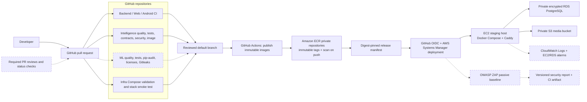

# FoodMind DevSecOps toolchain

This diagram reflects the implemented repositories and AWS staging path. Dashed elements are prepared in source but require deployment or repository-policy activation before they can be presented as operational controls.

## Where to demonstrate each control

| Control | Authoritative location | Presentation evidence |
| --- | --- | --- |
| Source and review | GitHub repository Pull requests and branch rules | Reviewed PR, required checks, protected default branch |
| CI quality gates | Each repository's **Actions** tab | Successful gate jobs and uploaded test evidence |
| Dependency and secret security | Intelligence and ML Actions workflows | `pip-audit`, license, Gitleaks, SBOM, Trivy results |
| Artifact integrity | Infra release manifest and Amazon ECR | SHA-256 image digests, immutable tags, scan-on-push |
| Deployment identity | Infra `Deploy staging` workflow | GitHub OIDC role session; no long-lived AWS key |
| Runtime isolation | EC2 security group and Docker Compose | Only ports 80/443 public; RDS private; services unexposed |
| Dynamic testing | Infra `Staging DAST` workflow | Initial findings, fixed headers, successful ZAP rescan artifact |
| Runtime monitoring | CloudWatch Logs, Alarms, SNS | Current streams, alarm states, confirmed notification |

Prepared controls shown with dashed lines must not be described as active until their PRs are merged and their runtime evidence is captured.
