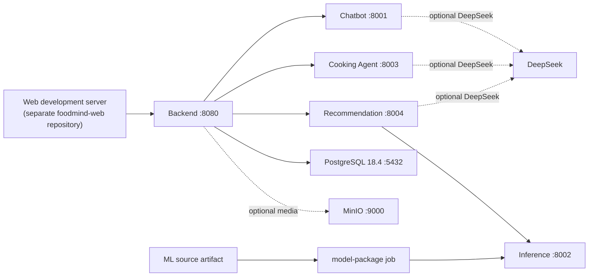

# Runtime topology

All calls between Backend and Agents use a private service token. Chatbot's
read-only Backend tools additionally carry a short-lived user delegation token;
the tool remains scoped to the requesting user's authorised records, products,
and places. No Compose secret is logged by health checks or the model build.

The model package job takes the versioned source artifact from the ML submodule
and generates `manifest.json` plus the six-feature runtime package in a named
volume. Inference starts only after that job succeeds, and Recommendation
starts only after Inference is healthy.
